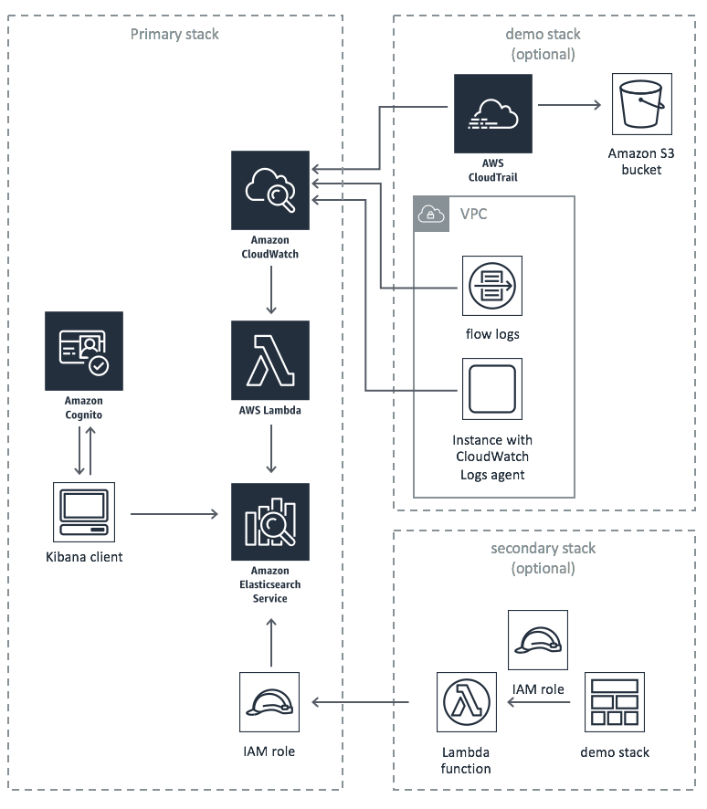

# AWS Centralized Logging Solution
The AWS Centralized Logging Solution is a reference implementation that provides a foundation for logging to a centralized account. Customers can leverage the solution to index CloudTrail Logs, CW Logs, VPC Flow Logs on a ElasticSearch domain. The logs can then be searched on different fields.


## Implementation Overview
The diagram below presents the centralized logging architecture you can automatically deploy using the solution's implementation guide and accompanying AWS CloudFormation templates.



## Getting Started
To get started with the AWS Centralized Logging Solution, please review the solution documentation. https://aws.amazon.com/solutions/implementations/centralized-logging/

## Upgrading to v3.2
Customers using v3.0.0 can upgrade to v3.2 by loading the new primary template. Spoke templates, however, must be removed and installed from the v3.2 spoke template.

## Running unit tests for customization
* Clone the repository, then make the desired code changes
* Next, run unit tests to make sure added customization passes the tests
```
cd ./deployment
chmod +x ./run-unit-tests.sh  \n
./run-unit-tests.sh \n
```

## Building distributable for customization
* Configure the bucket name of your target Amazon S3 distribution bucket
```
export TEMPLATE_OUTPUT_BUCKET=my-bucket-name # bucket where cfn template will reside
export DIST_OUTPUT_BUCKET=my-bucket-name # bucket where customized code will reside
export VERSION=my-version # version number for the customized code
```
_Note:_ You would have to create 2 buckets, one with prefix 'my-bucket-name' and another regional bucket with prefix 'my-bucket-name-<aws_region>'; aws_region is where you are testing the customized solution. Also, the assets  in bucket should be publicly accessible

* Now build the distributable:
```
chmod +x ./build-s3-dist.sh \n
./build-s3-dist.sh $DIST_OUTPUT_BUCKET $TEMPLATE_OUTPUT_BUCKET $VERSION \n
```

* Deploy the distributable to an Amazon S3 bucket in your account. _Note:_ you must have the AWS Command Line Interface installed.
```
aws s3 cp ./dist/ s3://my-bucket-name/centralized-logging/<my-version>/ --recursive --exclude "*" --include "*.template" --include "*.json" --acl bucket-owner-full-control --profile aws-cred-profile-name \n
aws s3 cp ./dist/ s3://my-bucket-name-<aws_region>/centralized-logging/<my-version>/ --recursive --exclude "*" --include "*.zip" --acl bucket-owner-full-control --profile aws-cred-profile-name \n
```

* Get the link of the centralized-logging-primary.template uploaded to your Amazon S3 bucket.
* Deploy the AWS Centralized Logging Solution to your account by launching a new AWS CloudFormation stack using the link of the centralized-logging-primary.template.

## File Structure
The AWS Centralized Logging Solution project consists of indexing microservices which is deployed to a serverless environment in AWS Lambda.

```
|-source/
  |-services/
    |-indexing/      [ microservice for indexing logs on ES domain ]
      |-lib/
        |-[ service module unit tests ]
        |-basic-dashboard.json [ sample dashboard for kibana ]
        |-logger.js [ logger class ]
        |-metrics-helper.js [ helper module for sending anonymous metrics ]
      |-index.js [ injection point for microservice ]
      |-package.json
    |-auth/      [ microservice for enabling Cognito auth ]
      |-index.js [ injection point for microservice ]
      |-logger.js [ logger class ]
      |-package.json
```
***

## v3.2.1 changes
```
* Elasticsearch version update to 7.4
* NodeJS update to 12.x
```

## v3.0.1 changes
```
* Amazon Cognito integration for user login
* Elasticsearch version update to 6.3
* Elasticsearch encryption at rest
* T-shirt sizing update
```

***

Copyright 2020 Amazon.com, Inc. or its affiliates. All Rights Reserved.

Licensed under the Apache License Version 2.0 (the "License"). You may not use this file except in compliance with the License. A copy of the License is located at

    http://www.apache.org/licenses/

or in the "license" file accompanying this file. This file is distributed on an "AS IS" BASIS, WITHOUT WARRANTIES OR CONDITIONS OF ANY KIND, express or implied. See the License for the specific language governing permissions and limitations under the License.

