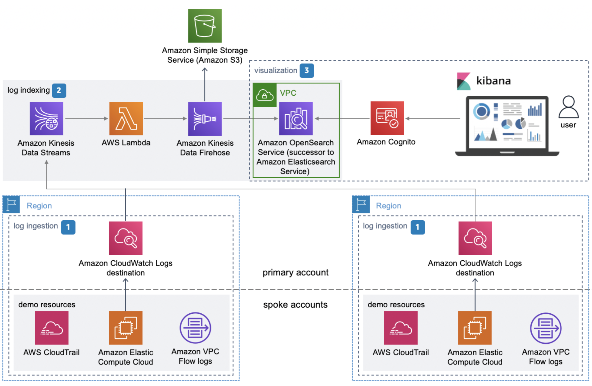

# Centralized Logging on AWS Solution

_Note:_ For any relevant information outside the scope of this readme, please refer to the solution landing page and implementation guide.

**[🚀Solution Landing Page](https://aws.amazon.com/solutions/implementations/centralized-logging/)** | **[🚧Feature request](https://github.com/aws-solutions/aws-centralized-logging/issues/new?assignees=&labels=feature-request%2C+enhancement&template=feature_request.md&title=)** | **[🐛Bug Report](https://github.com/aws-solutions/aws-centralized-logging/issues/new?assignees=&labels=bug%2C+triage&template=bug_report.md&title=)** | **[📜Documentation Improvement](https://github.com/aws-solutions/aws-centralized-logging/issues/new?assignees=&labels=document-update&template=documentation_improvements.md&title=)**

## Table of content

- [Solution Overview](#solution-overview)
- [Architecture](#architecture)
- [Installation](#installing-pre-packaged-solution-template)
- [Customization](#customization)
  - [Setup](#setup)
  - [Changes](#changes)
  - [Unit Test](#unit-test)
  - [Build](#build)
  - [Deploy](#deploy)
- [Sample Scenario](#sample-scenario)
- [File Structure](#file-structure)
- [License](#license)

## Solution Overview

Centralized Logging on AWS is a reference implementation that provides a foundation for logging to a centralized account. Customers can leverage the solution to index CloudTrail Logs, CW Logs, VPC Flow Logs on an Amazon OpenSearch Service domain. The logs can then be searched on different fields.

This solution gives you a turnkey environment to begin logging and analyzing your AWS environment and applications. Additionally, if you are looking to

- collect logs from multiple AWS accounts and organizations
- collect logs from multiple regions
- a single pane view for log analysis and visualization

then you can get all this with this 1-click deployment solution.

This solution uses Amazon OpenSearch Service (successor to Amazon Elasticsearch Service) and Kibana, an analytics and visualization platform that is integrated with Amazon OpenSearch Service, that results in a unified view of all the log events.

## Architecture

The Centralized Logging on AWS solution contains the following components: **log ingestion**, **log indexing**, and **visualization**. You must deploy the AWS CloudFormation template in the AWS account where you intend to store your log data.



## Installing pre-packaged solution template

- Primary Template: [aws-centralized-logging.template](https://solutions-reference.s3.amazonaws.com/centralized-logging/latest/aws-centralized-logging.template)

- Demo Template: [Demo.template](https://solutions-reference.s3.amazonaws.com/centralized-logging/latest/aws-centralized-logging-demo.template)

## Customization

- Prerequisite: Node.js>=16 | npm >= 8

### Setup

Clone the repository and run the following commands to install dependencies, format and lint as per the project standards

```
npm ci
npm run prettier-format
npm run lint
```

### Changes

You may make any needed change as per your requirement. If you want to customize the Centralized Logging on AWS opinionated defaults, you can modify the [solution manifest file](./source/resources/lib/manifest.json). You can also control sending solution usage metrics to aws-solutions, from the manifest file.

```
"solutionVersion": "%%VERSION%%", #provide a valid value eg. v1.0
"sendMetric": "Yes",
```

Additionally, you can customize the code and add any extension to the solution. Please review our [feature request guidelines](./.github/ISSUE_TEMPLATE/feature_request.md), if you want to submit a PR.

### Unit Test

You can run unit tests with the following command from the root of the project

```
 npm run test
```

### Build

You can build lambda binaries with the following command from the root of the project

```
 npm run build
```

### Deploy

Run the following command from the root of the project. Deploys all the primary solution components needed for Centralized Logging on AWS. **Deploy in Primary Account**

```
cd source/resources
npm ci
```

```
npm run cdk-bootstrap -- --profile <PROFILE_NAME>
npm run cdk-synth
npm run cdk-deploy -- CL-PrimaryStack --parameters AdminEmail=<EMAIL> --parameters SpokeAccounts=<ACCOUNT-ID-1,ACCOUNT-ID-2...> --parameters JumpboxKey=<EC2_KEY_PAIR> --parameters JumpboxDeploy='Yes' --profile <PROFILE_NAME>
```

_Note:_ for PROFILE_NAME, substitute the name of an AWS CLI profile that contains appropriate credentials for deploying in your preferred region.

## Sample Scenario (Enabling CloudWatch logging on Elasticsearch domain)

The default deployment uses opinionated values as setup in [solution manifest file](./source/resources/lib/manifest.json). In this scenario let's say we want to enable CloudWatch logging for ES domain.

You would need to update the **ESDomain** resource in cl-primary-stack.ts as below:

```
 logging: {
        slowSearchLogEnabled: true,
        appLogEnabled: true,
        slowIndexLogEnabled: true,
      },
```

## File structure

Centralized Logging on AWS solution consists of:

- cdk constructs to generate needed resources
- helper for bootstrapping purposes like creating CloudWatch Logs Destinations
- transformer to translate kinesis data stream records into Elasticsearch documents

<pre>
|-config_files                    [ config files for prettier, eslint etc. ]
|-architecture.png                [ solution architecture diagram ]
|-source/
  |dashboard.ndjson               [ sample dashboard for demo ]  
  |run-unit-test.sh               [ script to run unit tests ]
  |-resources
    |-bin/
      |-app.ts                    [ entry point for CDK app ]
    |-__tests__/                  [ unit tests for CDK constructs ] 
    |-lib/
      |-cl-demo-ec2-construct.ts  [ CDK construct for demo web server resource ]
      |-cl-demo-stack.ts          [ CDK construct for demo stack]
      |-cl-jumpbox-construct.ts   [ CDK construct for windows jumpbox resource ]  
      |-cl-primary-stack.ts       [ CDK construct for primary stack and related resources ]
      |-utils.ts                  [ utilities for generic functionalities across CDK constructs ]   
      |-manifest.json             [ manifest file for CDK resources ]
    |-config_files                [ tsconfig, jest.config.js, package.json etc. ]
  |-services/
    |-@aws-solutions/utils/       [ library with generic utility functions for microservice ]
    |-helper/                     [ lambda backed helper custom resource to help with solution launch/update/delete ]
    |-transformer/                [ microservice to translate kinesis records into es documents ]
</pre>

## License

See license [here](./LICENSE.txt)

## Collection of operational metrics

This solution collects anonymous operational metrics to help AWS improve the quality and features of the solution. For more information, including how to disable this capability, please see the [implementation guide](https://docs.aws.amazon.com/solutions/latest/centralized-logging/collection-of-operational-metrics.html).

---

Copyright Amazon.com, Inc. or its affiliates. All Rights Reserved.

Licensed under the Apache License Version 2.0 (the "License"). You may not use this file except in compliance with the License. A copy of the License is located at

```
http://www.apache.org/licenses/LICENSE-2.0
```

or in the ["license"](./LICENSE.txt) file accompanying this file. This file is distributed on an "AS IS" BASIS, WITHOUT WARRANTIES OR CONDITIONS OF ANY KIND, express or implied. See the License for the specific language governing permissions and limitations under the License.
